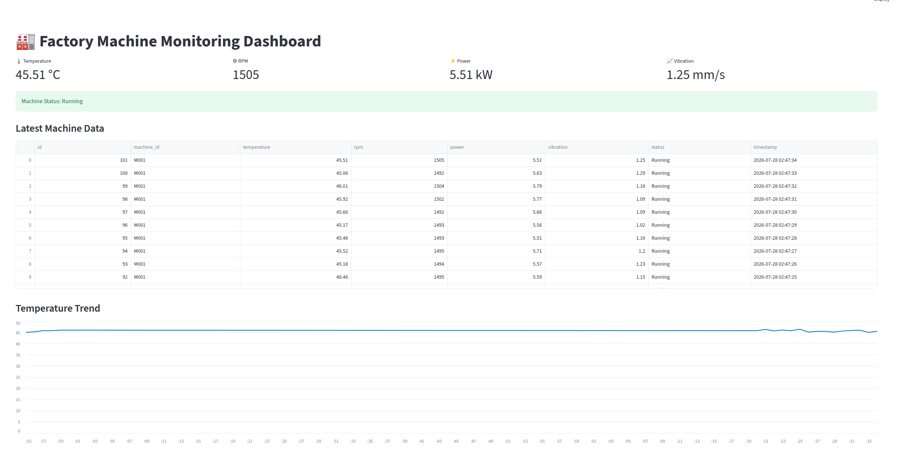
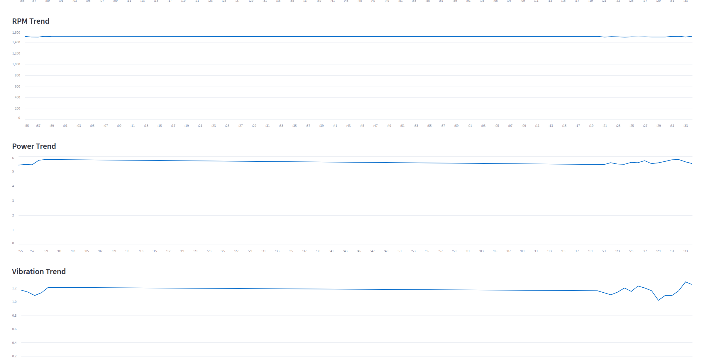

# 🏭 Industrial IoT Machine Monitoring Dashboard

A real-time Industrial IoT monitoring system built using **Python, MQTT, MySQL, and Streamlit**. This project simulates industrial machine sensor data, transmits it over MQTT, stores it in a MySQL database, and visualizes it through a live dashboard.

---

## 📌 Overview

This project demonstrates a complete Industrial IoT data pipeline commonly used in smart manufacturing and Industry 4.0 environments.

The system simulates machine sensor data, publishes it using MQTT, stores incoming data in a MySQL database through a subscriber, and displays the latest machine status and historical trends in a Streamlit dashboard.

---

## 🏗️ System Architecture

```
Machine Simulator
        │
        ▼
 MQTT Publisher
        │
        ▼
 Mosquitto Broker
        │
        ▼
 MQTT Subscriber
        │
        ▼
   MySQL Database
        │
        ▼
 Streamlit Dashboard
```

---

## 🚀 Features

- Industrial machine data simulation
- MQTT Publisher-Subscriber communication
- JSON-based message exchange
- Mosquitto MQTT Broker
- MySQL database integration
- Real-time data storage
- Streamlit monitoring dashboard
- Live machine metrics
- Historical sensor visualization
- Modular Python project structure

---

## ⚙️ Technologies Used

- Python 3
- MQTT
- Eclipse Mosquitto
- Paho MQTT
- MySQL
- MySQL Connector Python
- Pandas
- Streamlit

---

## 📂 Project Structure

```
industrial-iot-machine-monitoring/
│
├── config/
├── database/
│   ├── db_config.py
│   ├── db_connection.py
│   └── insert_data.py
│
├── publisher/
│   └── machine_publisher.py
│
├── subscriber/
│   └── mqtt_listener.py
│
├── dashboard/
│   ├── app.py
│   └── db_reader.py
│
├── tests/
├── docs/
├── logs/
├── requirements.txt
└── README.md
```

---

## 📊 Simulated Machine Parameters

The simulator generates realistic industrial machine data including:

- Machine ID
- Temperature (°C)
- RPM
- Power Consumption (kW)
- Vibration (mm/s)
- Machine Status

---

## 🖥️ Dashboard

The Streamlit dashboard displays:

- Latest machine status
- Temperature
- RPM
- Power
- Vibration
- Latest machine records
- Historical sensor trends

---

## 🗄️ Database Schema

Table: `machine_data`

| Column | Type |
|----------|------|
| id | INT |
| machine_id | VARCHAR |
| temperature | FLOAT |
| rpm | INT |
| power | FLOAT |
| vibration | FLOAT |
| status | VARCHAR |
| timestamp | TIMESTAMP |

---

## 📦 Installation

Clone the repository

```bash
git clone https://github.com/YOUR_USERNAME/industrial-iot-machine-monitoring.git

cd industrial-iot-machine-monitoring
```

Install dependencies

```bash
pip install -r requirements.txt
```

Start Mosquitto Broker

```bash
mosquitto
```

Run the MQTT Subscriber

```bash
python -m subscriber.mqtt_listener
```

Run the Publisher

```bash
python -m publisher.machine_publisher
```

Launch the Dashboard

```bash
streamlit run dashboard/app.py
```

---

## 📸 Screenshots

### Dashboard Overview



### Live Machine Monitoring




---

## 🎯 Learning Outcomes

This project demonstrates practical experience with:

- Industrial IoT
- MQTT Communication
- Python Programming
- JSON Serialization
- SQL & MySQL
- Database Design
- Streamlit Dashboard Development
- Data Visualization
- Modular Software Development
- Real-time Data Processing

---

## 🔮 Future Improvements

- Automatic dashboard refresh
- Machine failure prediction
- Predictive maintenance using Machine Learning
- Docker deployment
- REST API integration
- Multi-machine monitoring
- Alarm and notification system
- User authentication

---

## 👨‍💻 Author

**Ravi Kiran Kosuri**

Master's Student – Mechatronics & Cyber-Physical Systems  
Technische Hochschule Deggendorf

LinkedIn: *www.linkedin.com/in/ravikiran-kosuri-91ab701b2*

GitHub: *github/rkkosuri116*

---

## 📄 License

This project is developed for educational and portfolio purposes.